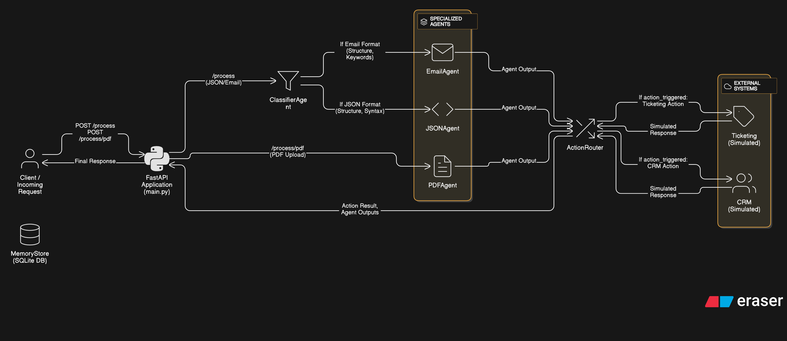

# Multi-Format Autonomous AI System

A FastAPI-based system that processes and analyzes various types of business documents and communications using AI agents.

## Features

- Process and analyze emails, PDFs, and JSON data
- Automatic format detection and classification
- Intelligent routing to specialized agents
- Activity logging and tracking
- Risk assessment and automated action triggering

## Setup

1. Create and activate a virtual environment:
```bash
python -m venv venv
.\venv\Scripts\activate  # Windows
source venv/bin/activate  # Linux/Mac
```

2. Install dependencies:
```bash
pip install -r requirements.txt
```

3. Set up environment variables (optional):
Create a `.env` file in the root directory:
```
DATABASE_URL=memory/activity_log.db
# OPENAI_API_KEY=your_openai_api_key # Add your OpenAI API key here
```
**Note:** An OpenAI API key is required for the AI agents to function.

4. Run the server:
```bash
python main.py
```

The server will start at `http://localhost:8000`

## Architecture and Agent Logic

Below is a visual diagram illustrating the system's architecture and agent workflow:



The system follows a modular, agent-based architecture designed to process and analyze diverse input formats efficiently. The core components are:

1.  **FastAPI Application (`main.py`)**: This serves as the entry point, exposing REST API endpoints (`/process`, `/process/pdf`, `/activity`). It receives incoming requests, routes them to the appropriate agents based on input type and format, and returns the final results.

2.  **AI Agents (`agents/`)**: A collection of specialized classes responsible for specific tasks:
    *   **`BaseAgent`**: A base class providing common functionality like logging activities to the Memory Store.
    *   **`ClassifierAgent`**: The initial processing step for inputs received via `/process`. It analyzes the input to determine its format (email, JSON, or potentially other text-based formats) and intent (e.g., communication, event, document). It routes the input to the appropriate specialized agent based on this classification.
    *   **`EmailAgent`**: Handles inputs classified as emails. It extracts key information such as sender, urgency, tone, and key points using a language model.
    *   **`JSONAgent`**: Processes inputs classified as JSON data, typically representing structured events or data payloads. It validates the JSON structure against a schema, checks for predefined anomalies (e.g., suspicious event types, high monetary values, unusual locations), determines a risk level, and can trigger specific actions based on the findings.
    *   **`PDFAgent`**: Processes PDF file uploads received via `/process/pdf`. It extracts text content from the PDF, truncates it to manage token limits, sends the relevant text to a language model to extract structured information (document type, key terms, dates, amounts, references), and can trigger actions based on the extracted content (e.g., for high-value invoices or regulatory documents).
    *   **`ActionRouter`**: Receives the output from specialized agents. If an agent's analysis includes a `action_triggered` field, the Action Router processes this trigger. It acts as a dispatcher to simulated (or potentially real, in a production setting) follow-up actions like escalating issues or creating tickets based on the specific trigger (e.g., different risk levels).

3.  **Memory Store (`memory/memory_store.py`)**: Manages the logging of all processing activities, classifications, extracted data, and triggered actions to an SQLite database. This provides a history of all processed inputs and system responses, accessible via the `/activity` endpoints.

## API Endpoints

### 1. Process JSON or Email Input (POST /process)

Processes inputs containing email content or JSON data and returns analysis.

**Content-Type:** `application/json`

#### Email Processing
```json
// Request
{
    "email_content": "From: sender@example.com\nSubject: Test Email\n\nThis is a test email content."
}

// Expected Response (example)
{
    "sender": "sender@example.com",
    "urgency": "low",
    "tone": "neutral",
    "key_points": ["Test email content"],
    "action_triggered": null
}
```

#### JSON Processing
```json
// Request
{
    "json_data": "{\"event_type\": \"unauthorized_access\", \"timestamp\": \"2024-03-15T10:30:00Z\", \"source\": \"security_system\", \"data\": {\"id\": \"123\", \"user_id\": \"user456\", \"ip_address\": \"192.168.1.1\", \"attempted_resource\": \"/api/admin\"}}"
}

// Expected Response (example - high risk triggering action)
{
    "is_valid": true,
    "data": { /* ... original json data ... */ },
    "anomalies": ["suspicious_event: unauthorized_access"],
    "risk_level": "high",
    "action_triggered": "POST /risk_alert/high",
    "action_result": {
        "status": "success",
        "action_simulated": "POST to Risk Alert System (High) / Escalation System",
        "message": "Simulated: High risk issue escalated.",
        "escalation_ref": "ESCALATION-xxxxx"
    }
}
```

### 2. Process PDF File Upload (POST /process/pdf)

Processes PDF documents uploaded as files and returns analysis.

**Content-Type:** `multipart/form-data`

#### PDF Processing
```json
// Request (multipart/form-data)
// Use 'form-data' in clients like Postman or with curl
// Key: file
// Value: PDF file
// Content-Type: application/pdf

// Expected Response (example)
{
    "document_type": "invoice",
    "key_terms": ["Payment Terms", "Due Date"],
    "important_dates": ["2024-04-01"],
    "monetary_amounts": ["15000.00"],
    "regulatory_references": [],
    "action_triggered": "POST /risk_alert", // or /risk_alert/high, /risk_alert/critical based on content
    "action_result": { /* ... simulated action details if triggered ... */ }
}
```

### 3. Get All Activities (GET /activity)

Retrieves all logged activities.

```json
// Request
GET /activity

// Expected Response (example)
[
    {
        "source": "email",
        "timestamp": "2024-03-15T10:30:00Z",
        "classification": { /* ... */ },
        "extracted_fields": { /* ... */ },
        "action_triggered": null,
        "agent_trace": ["classifier_agent", "email_agent", "Action Handled: ..." // Includes action router trace if action triggered]
    }
]
```

### 4. Get Activity by ID (GET /activity/{activity_id})

Retrieves a specific activity by ID.

```json
// Request
GET /activity/1

// Expected Response (example)
{
    "source": "email",
    "timestamp": "2024-03-15T10:30:00Z",
    "classification": { /* ... */ },
    "extracted_fields": { /* ... */ },
    "action_triggered": null,
    "agent_trace": ["classifier_agent", "email_agent", "Action Handled: ..." // Includes action router trace if action triggered]
}
```

## Postman Collection

For easy testing of all API endpoints, a Postman collection is available in the project root directory:

- File: `postman_collection.json`

To use the collection:

1. Open Postman.
2. Click the `Import` button.
3. Select the `postman_collection.json` file from your project directory.
4. The collection will be imported, and you can then explore and run the predefined requests for each endpoint.

## Action Routing

The system includes an `ActionRouter` that processes the output of the specialized agents. When an agent identifies a condition that requires a follow-up step (indicated by the `action_triggered` field in its output), the Action Router intercepts this and simulates performing a predefined action.

This acts as a placeholder for integration with external systems like CRM, ticketing systems, or dedicated risk management platforms.

Currently, the `ActionRouter` is configured to simulate actions based on risk levels triggered by the agents:

-   **General Risk Alert (`POST /risk_alert`)**: Simulated logging of a general alert.
-   **High Risk Alert (`POST /risk_alert/high`)**: Simulated **escalation of the issue**. The simulated response includes an `escalation_ref`.
-   **Critical Risk Alert (`POST /risk_alert/critical`)**: Simulated **creation of a high-priority ticket** and **flagging for compliance risk**. The simulated response includes a `ticket_id` and a `compliance_flagged` status.

When an action is triggered and processed by the `ActionRouter`, the response from the `/process` or `/process/pdf` endpoint will include an `action_result` field containing the details of the simulated action.

## Error Responses

```json
// 400 Bad Request (examples)
{ "detail": "Invalid email format" }
{ "detail": "Invalid JSON data" }
{ "detail": "Unsupported Content-Type for /process endpoint: text/plain. Use /process/pdf for PDF files." }
{ "detail": "Invalid file type. Only PDF files are supported on this endpoint." }
{ "detail": "No file found in form-data" }
{ "detail": "Missing boundary in multipart." }

// 404 Not Found (example)
{ "detail": "Activity not found" }

// 500 Internal Server Error (example - includes LLM errors)
{ "detail": "Error message here" }
{ "detail": "Error code: 400 - {'error': {'message': \"This model's maximum context length is..."}}"}
```

## Testing with curl

1. Process JSON (Email Input):
```bash
curl -X POST "http://localhost:8000/process" \
     -H "Content-Type: application/json" \
     -d '{"email_content": "From: sender@example.com\nSubject: Test Email\n\nThis is a test email content."}'
```

2. Process JSON (JSON Data Input - triggers high risk action):
```bash
curl -X POST "http://localhost:8000/process" \
     -H "Content-Type: application/json" \
     -d '{"json_data": "{\"event_type\": \"unauthorized_access\", \"timestamp\": \"2024-03-15T10:30:00Z\", \"source\": \"security_system\", \"data\": {\"id\": \"123\", \"user_id\": \"user456\", \"ip_address\": \"192.168.1.1\", \"attempted_resource\": \"/api/admin\"}}"}'
```

3. Process PDF File:
```bash
curl.exe -X POST "http://localhost:8000/process/pdf" \
     -F "file=@samples/Suhaib Resume.pdf"
```
(Note: Use `curl.exe` on Windows PowerShell)

4. Get All Activities:
```bash
curl "http://localhost:8000/activity"
```

5. Get Specific Activity:
```bash
curl "http://localhost:8000/activity/1"
```

## Project Structure

```
.
├── agents/
│   ├── base_agent.py
│   ├── classifier_agent.py
│   ├── email_agent.py
│   ├── json_agent.py
│   ├── pdf_agent.py
│   └── action_router.py
├── memory/
│   └── memory_store.py
├── tests/
├── main.py
├── requirements.txt
└── README.md
```

## Dependencies

- FastAPI
- LangChain
- OpenAI
- PyPDF2
- SQLite3
- Pydantic
- python-dotenv (for environment variables)

## License

This project is licensed under the MIT License - see the LICENSE file for details. 